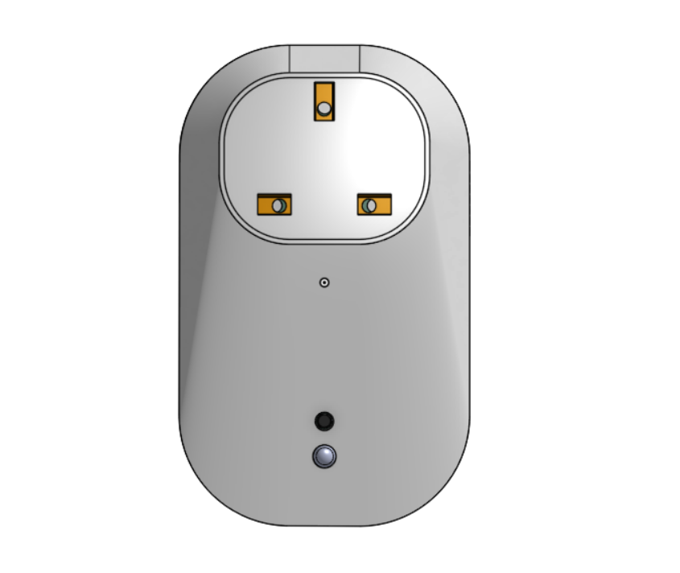
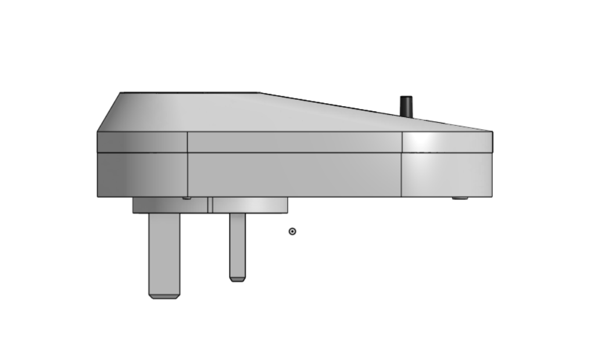
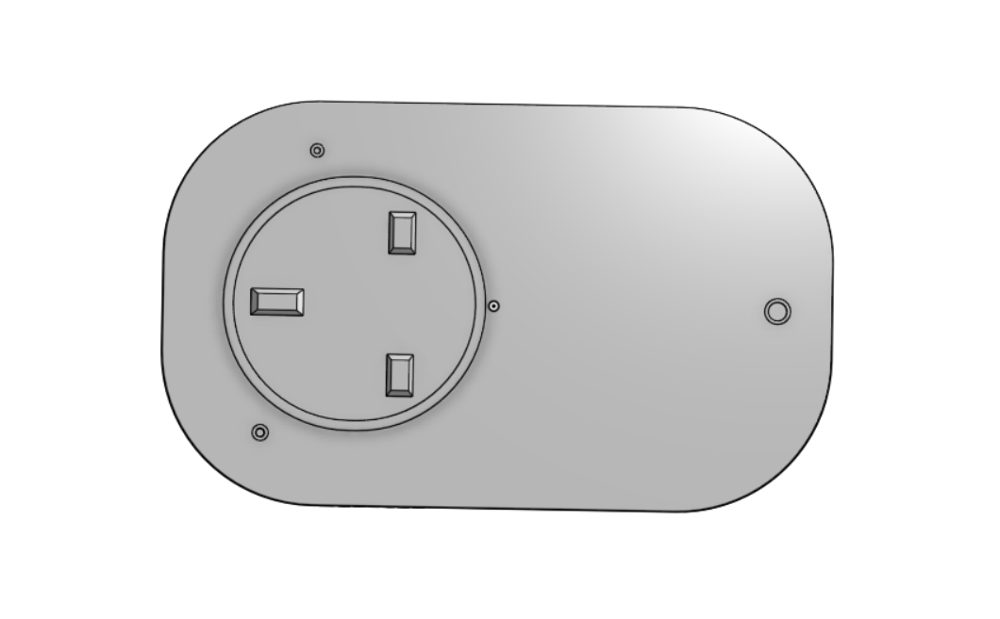

# 3D Power Monitor Project

This is a 3D Smart Power Monitor design I created using **Onshape**.  
It was completed as part of a university module assignment.

---

## 📸 Images

**3D View**  

**Top View**  

**Side View**  

**Bottom View**  

---

## 🛠 Tools & Software Used
- **CAD Software:** Onshape

---

## 📄 License
This project is shared for educational purposes. Please give credit if you use it.
