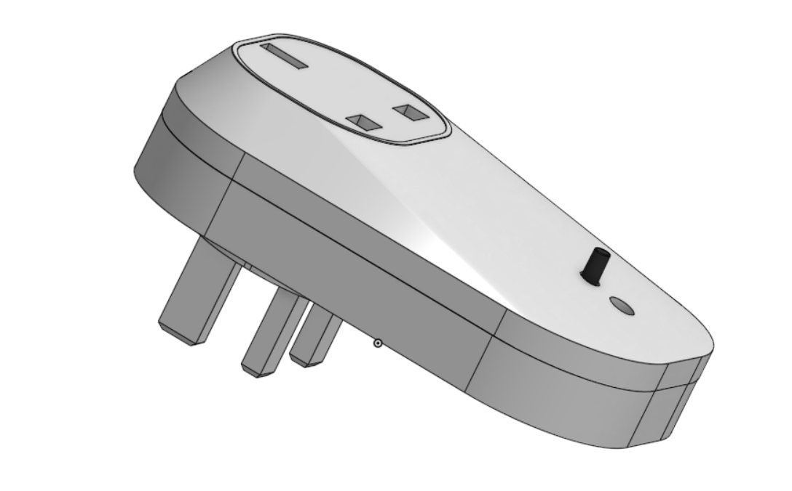

# 3D_Power_Monitor
A 3D Smart Power Monitor

# 🚀 My 3D Power Monitor Project

This is a 3D design of a Smart Power Monitor I created using **Onshape**.  
This was completed as a part of my university module assignment.

---

## 📸 Images

**3D View**  

**Top View**  

**Side View**  

**Bottom View**  

---

## 🛠 Tools & Software Used
- **CAD Software:** Onshape

---

## 📄 License
This project is shared for educational purposes. Please give credit if you use it.
